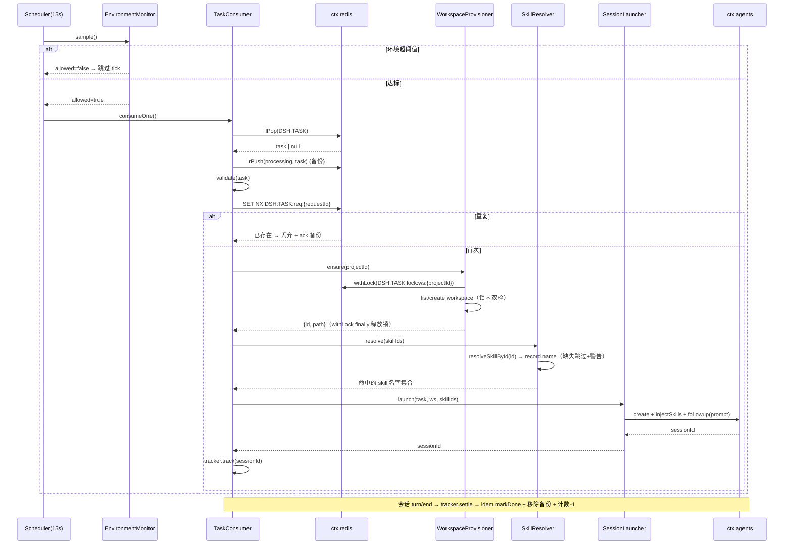

# dsh-redis-queue-custom-plugin 设计方案

> 面向 [deepseek-harness](https://github.com/deepseek-ai/deepseek-harness)（dsh，基于 [Cordis](https://cordis.js.org)）的 **Redis 队列消费插件**：在环境资源（CPU / 内存 / 运行中会话数）达标的前提下，定时从 Redis 队列 `DSH:TASK` 拉取翻译任务，完成 **幂等去重 → 工作区创建（分布式锁保护）→ Skills 解析 → 会话创建并投递 prompt** 的全链路消费。
>
> 复用的既有插件能力：
> - Redis 基座：`E:\htmlProjects\dsh-redis-plugin`（提供 `ctx.redis`：list / string / 分布式锁 + watchdog）
> - 工作区 & 会话内核参考：`E:\htmlProjects\Remote-Task`（`ctx.workspaceRegistry`、`ctx.agents.create`、`injectSkills`、`resolveModelSelection`）
> - Skills 来源：`E:\htmlProjects\Skills-Manager`（`ctx.skillsManager` + 注册进 `ctx.skills` 的 provider）

---

## 一、需求与决策

### 1.1 核心需求

1. 从 Redis key `DSH:TASK` 消费任务，队列元素为固定 schema 的 JSON（见 §3）。
2. **环境准入**：每次消费前监控 CPU、内存、正在运行的会话数量，只有全部在阈值内才拉取一个任务。
3. **定时扫描**：每 15s 扫描一次环境，达标则消费一个任务。
4. **工作区（projectId）**：按 `projectId` 判断工作区是否存在，存在则复用，不存在则创建；创建时以 `projectId` 生成 **分布式锁** 避免并发创建冲突，创建完成后 **正确释放锁**。
5. **幂等（requestId）**：以 `requestId` 做幂等，防止同一任务被多次执行。
6. **Skills（skillIds）**：从 Skills-Manager 按 id 解析对应 skill；不存在则 **跳过并输出一条警告**。
7. **会话创建**：拿到任务后触发工作区创建、会话创建，并投递由任务字段拼装的 prompt。接口 / 方法参考 Remote-Task。

### 1.2 关键设计决策

| 项 | 决策 | 理由 |
|---|---|---|
| 消费触发 | **定时轮询**（`setInterval` 15s，`ctx.effect` 注册可回滚），每 tick 至多消费 `batchSize`（默认 1）个任务 | 与「环境达标才消费」的门控模型天然契合；避免无节制拉取压垮宿主 |
| 出队方式 | 默认 **非阻塞** `lPop`（生产者 `rPush` → FIFO）；可切 `blocking`（`brPop` 短超时）降低延迟 | 非阻塞出队便于「先门控后出队」，且 tick 不会被阻塞连接占满 |
| 可靠性 | 出队后写入 **处理中备份**，失败按重试计数 **requeue** 或进 **死信队列 `DSH:TASK:DLQ`** | 崩溃 / 异常不丢任务，实现 at-least-once |
| 幂等 | `SET NX` 抢占 `DSH:TASK:req:{requestId}`，值记录状态（`processing`/`done`）；成功置 `done` 并延长 TTL，可恢复失败则 `DEL` 后 requeue | 一条任务被多实例 / 重复投递时只执行一次 |
| 工作区锁 | `ctx.redis.lock.withLock('DSH:TASK:lock:ws:{projectId}', fn, { ttl, retryCount, retryInterval, onLost })`，`finally` 自动释放 + watchdog 续期 | 直接复用 redis 插件的锁能力，满足「创建完成后释放」 |
| 会话创建 | **直连宿主原语**（`ctx.agents.create` + `injectSkills` + `agent.followup`），复刻 Remote-Task 的最小创建路径 | 无 HTTP 跳转、自包含；Remote-Task 的 `SessionRegistry` 未暴露到 `ctx`，无法直接注入 |
| 会话生命周期 | 本插件只做「创建 + 首轮投递 + 完成计数」；如需暂停/停止/恢复/记忆蒸馏，**可与 Remote-Task 共存**并改为调用其 HTTP API（见 §12 备选集成） | 关注点分离，避免重复实现完整内核 |
| 并发计数 | 内部 `ActiveSessionTracker` 统计本插件已创建且未终结的会话数，作为准入闸门 | 这是「正在运行的会话数量」对本插件最有意义的度量 |

---

## 二、需求到既有能力的映射

| 需求 | 复用的能力 / API | 来源 |
|---|---|---|
| 队列出队 | `ctx.redis.lPop<T>(key)` / `rPop<T>` / `brPop<T>(key, sec)` / `lLen` / `lPush`（requeue、DLQ） | dsh-redis-plugin `operations/list.ts` |
| 幂等抢占 | `ctx.redis.setIfAbsent(key, value, ttl?, unit?)` → boolean（`SET NX PX`）；`get` / `setEx` / `del` | dsh-redis-plugin `operations/string.ts`、`key.ts` |
| 分布式锁 | `ctx.redis.lock.withLock(key, fn, opts)` / `tryLock` / `unlock`；watchdog 自动续期，`finally` 释放 | dsh-redis-plugin `lock/redis-lock.ts` |
| 工作区创建 / 复用 | `ctx.workspaceRegistry.list()` / `.get(id)` / `.create(path, title)`（按规范路径幂等）；`workspace.attachSession(sessionId)` | Remote-Task `workspace.ts` 同款用法 |
| 会话创建 | `ctx.agents.create({ sessionId, meta:{cwd}, agentOptions, setup })` → `AgentHandle` | Remote-Task `session.ts#composeCreate` |
| prompt 投递 | `agent.followup(createUserMessage({ content:[{type:'text',text}], source:{kind:'user'} }))` | Remote-Task `session.ts#prompt` |
| 模型路由 | `ctx.llm.resolveCallConfig(draft)`（封装为 `resolveModelSelection`） | Remote-Task `model.ts` |
| Skill 解析 / 注入 | `ctx.skillsManager.resolveSkillById(id)`（按需拉取/安装，返回 `SkillRecord`）→ 取 `record.name`；`ctx.skills.get(name,{scope:agent,cwd})` + `agentCtx.skills.register(...)` | Skills-Manager `service.ts` + Remote-Task `skills.ts#injectSkills` |
| 完成 / 状态事件 | `ctx.on('session/event', ...)`（`turn/end`）、`ctx.on('agent/status', ...)`、`ctx.on('agent/error', ...)` | Remote-Task `registry.ts` |
| 生命周期 | `ctx.effect(setup → disposer)`：定时器、事件订阅、优雅停机全部可回滚 | Cordis + 两个参考插件 |

**关键结论**：本插件 = 「**redis 插件的队列 / 锁 / 幂等能力**」+「**Remote-Task 的工作区 / 会话 / Skills 创建路径**」+「**一层环境门控与定时调度**」。不重复造 Redis 与会话内核，只做编排。

---

## 三、任务 schema 与字段语义

队列 `DSH:TASK` 中每个元素为一条 JSON（redis 插件默认 `value: json` 编解码，`lPop<TaskPayload>` 直接得到对象）：

```jsonc
{
  "agentId": "{预留}",
  "platform": "Chiao",
  "projectId": "D25081438501",
  "requestId": "1234-abcd-5678-efgh",
  "skillIds": ["1", "2", "3"],
  "sourceLang": "zh",
  "targetLang": "en",
  "taskName": "项目D25081438501的翻译任务",
  "userCode": "S00182"
}
```

| 字段 | 类型 | 语义 | 消费期用途 |
|---|---|---|---|
| `agentId` | string | **预留** | 本期仅透传记录，不参与逻辑；schema 保留位 |
| `platform` | string | 平台名称 | 写入 prompt 上下文 / 日志标签 |
| `projectId` | string | 工作区 id | **工作区存在性判断 + 分布式锁 key + 目录名** |
| `requestId` | string | 会话 id | **幂等键**（`DSH:TASK:req:{requestId}`），一任务一次 |
| `skillIds` | string[] | 指定 skill 列表 | 从 Skills-Manager 解析；缺失跳过 + 警告 |
| `sourceLang` | string | 源语言 | 拼入 prompt |
| `targetLang` | string | 目标语言 | 拼入 prompt |
| `taskName` | string | 任务名称 | 工作区 title / prompt 标题 |
| `userCode` | string | 创建任务的用户 | prompt 上下文 / 审计日志 |

**校验规则**（不满足 → 判为坏消息，进 DLQ，不阻塞后续消费）：`projectId`、`requestId` 为非空字符串；`skillIds` 为字符串数组（可空）；`sourceLang`/`targetLang`/`taskName`/`userCode`/`platform` 存在性做宽松校验（缺失记警告并回落默认，不直接失败）。

> **skillId 与 Skills-Manager 的对应**：任务里的 `skillIds` 是业务侧/外部目录 id。Skills-Manager 现已提供 **专用按 id 入口** `resolveSkillById(id)`：先按外部 id（`sourceDetail.remoteSkillId`）匹配、再按内部 `SkillRecord.id`（`hash(source::relativePath)`）匹配，仍未命中且配置了远程解析器时 **按需下载安装**，返回安装后的 `SkillRecord`（无法解析则返回 `undefined`）。解析器据此取 `record.name`（kebab-case）作为注入键——因为 `ctx.skills` 注册表是 **按名字寻址** 且只列出已安装的 skill，故按 id 的取数必须走 `resolveSkillById`。解析不到则 **跳过并 `ctx.logger.warn`**（对齐 Remote-Task `injectSkills` 的「不可解析即跳过」策略）。

---

## 四、整体架构

插件为 **Host 单面插件**（无 client UI），挂载在 dsh 的 **web profile**（与 Remote-Task、Skills-Manager、dsh-redis-plugin 同 profile，才能注入到 `agents/llm/skills/sessions/workspaceRegistry/skillsManager/redis`）。

```mermaid
graph TD
    Timer["Scheduler (setInterval 15s, ctx.effect)"] -->|tick| Gate["EnvironmentMonitor 门控"]
    Gate -->|CPU/内存/会话数 达标| Consumer["TaskConsumer"]
    Gate -->|超阈值| Skip["跳过本 tick (debug 日志)"]
    Consumer -->|lPop DSH:TASK| Redis[("ctx.redis (dsh-redis-plugin)")]
    Consumer --> Validate["Schema 校验"]
    Validate -->|非法| DLQ[("DSH:TASK:DLQ")]
    Validate -->|合法| Idem["幂等抢占 SET NX DSH:TASK:req:{requestId}"]
    Idem -->|已存在| Drop["跳过 (重复任务)"]
    Idem -->|抢占成功| Provision["WorkspaceProvisioner"]
    Provision -->|withLock DSH:TASK:lock:ws:{projectId}| Redis
    Provision -->|list/create/attach| WSReg["ctx.workspaceRegistry"]
    Provision --> Skills["SkillResolver"]
    Skills -->|resolveSkillById(id)| SM["ctx.skillsManager (Skills-Manager)"]
    Skills --> Launcher["SessionLauncher"]
    Launcher -->|agents.create + injectSkills + followup| Agents["ctx.agents / ctx.skills / ctx.llm"]
    Launcher --> Tracker["ActiveSessionTracker"]
    Agents -->|session/event turn-end, agent/status, agent/error| Tracker
    Tracker -->|完成: 置 done / 失败: requeue 或 DLQ| Redis
    Tracker -->|运行中会话数| Gate
```

设计要点：

- **门控前置**：先判环境再出队，避免资源紧张时把任务弹出却无法处理。
- **一次一任务**：每 tick 至多 `batchSize`（默认 1）个，配合 15s 间隔形成平滑节流。
- **注册即副作用**：定时器、事件订阅、优雅停机全部 `ctx.effect()`，HMR / unload 干净回滚。
- **失败可恢复**：出队即备份，异常按重试计数 requeue 或落 DLQ，幂等键随状态迁移。
- **编排而非重实现**：Redis、会话内核、Skills 全部委托既有插件 / 宿主服务。

---

## 五、工程结构

```
dsh-redis-queue-custom-plugin/
├── package.json               # type:module；peerDeps 对齐 Remote-Task + 依赖 dsh-redis-plugin
├── tsconfig.json              # emit lib + lib/types
├── cordis.patch.yml           # 把插件插入 web profile 层栈（在 redis/agents/skills 之后）
├── .env.example               # REDIS_QUEUE_* 环境变量样例
├── DESIGN.md                  # 本文档
├── src/
│   ├── index.ts               # 插件入口：name / inject / Config / apply（编排装配）
│   ├── config.ts              # Config schema（schemastery）+ resolveConfig + assertConfig
│   ├── types.ts               # TaskPayload / 内部类型 + Cordis Context 声明合并
│   ├── scheduler.ts           # Scheduler：15s 定时器 + 重入保护 + 优雅停机
│   ├── monitor.ts             # EnvironmentMonitor：CPU/内存采样 + 会话数门控
│   ├── consumer.ts            # TaskConsumer：出队→校验→幂等→编排→失败处置
│   ├── idempotency.ts         # IdempotencyGuard：SET NX 抢占 / 置 done / 释放
│   ├── workspace.ts           # WorkspaceProvisioner：分布式锁内 list/create/attach
│   ├── skills.ts              # SkillResolver：resolveSkillById 按 id 解析 + 缺失跳过警告
│   ├── launcher.ts            # SessionLauncher：agents.create + injectSkills + followup
│   ├── tracker.ts             # ActiveSessionTracker：运行中会话计数 + 完成事件订阅
│   ├── prompt.ts              # buildPrompt(task)：由任务字段拼装首轮 prompt
│   └── host/dsh-sdk.d.ts      # 本地 ambient stub（独立 typecheck 用；进 monorepo 删除）
├── scripts/
│   ├── clean.mjs
│   └── preflight.mjs
└── test/                      # vitest，全离线（FakeRedis + 服务桩）
    ├── monitor.test.ts
    ├── consumer.test.ts
    ├── idempotency.test.ts
    ├── workspace.test.ts
    ├── skills.test.ts
    └── stubs/
```

模块划分原则：**调度 / 门控 / 消费 / 幂等 / 工作区 / Skills / 会话 / 计数** 各司一职，`consumer.ts` 为唯一编排者，其余为可单测的纯逻辑单元（依赖以接口注入，便于打桩）。

---

## 六、配置设计（`config.ts` + `cordis.patch.yml`）

### 6.1 Config schema（schemastery）

```ts
export const Config = z.object({
  enabled: z.boolean().default(true),
  queueKey: z.string().default('DSH:TASK'),
  deadLetterKey: z.string().default('DSH:TASK:DLQ'),
  processingKey: z.string().default('DSH:TASK:processing'),

  pollIntervalMs: z.number().step(1).min(1000).default(15_000), // 定时扫描间隔
  consumeMode: z.enum(['poll', 'blocking']).default('poll'),     // 非阻塞 lPop / 阻塞 brPop
  blockingTimeoutSec: z.number().default(5),                     // consumeMode=blocking 时
  fifo: z.boolean().default(true),                               // true: lPop(配 rPush 生产)
  batchSize: z.number().step(1).min(1).default(1),               // 每 tick 消费上限

  workspaceRoot: z.string().default(''),                         // 空→ ~/.dsh/redis-queue/workspaces
  defaultProvider: z.string().default('deepseek'),
  defaultModel: z.string().default('deepseek-chat'),
  promptTemplate: z.string().default(''),                        // 可选：覆盖默认 prompt 模板

  requeueOnFailure: z.boolean().default(true),
  maxRetries: z.number().step(1).min(0).default(3),

  idempotency: z.object({
    keyPrefix: z.string().default('DSH:TASK:req'),
    processingTtlMs: z.number().default(3_600_000),   // 处理中占位 1h
    doneTtlMs: z.number().default(604_800_000),        // 完成后保留 7d
  }).default({}),

  lock: z.object({
    keyPrefix: z.string().default('DSH:TASK:lock:ws'),
    ttlMs: z.number().default(30_000),
    retryCount: z.number().default(50),
    retryIntervalMs: z.number().default(200),
    wsCacheTtlMs: z.number().default(86_400_000),      // projectId→workspaceId 缓存
  }).default({}),

  thresholds: z.object({
    maxCpuUsageRatio: z.number().default(0.85),        // CPU 使用率上限
    maxMemoryUsageRatio: z.number().default(0.90),     // 系统内存使用率上限
    maxConcurrentSessions: z.number().step(1).default(3), // 运行中会话数上限
    cpuSampleWindowMs: z.number().default(1_000),      // CPU 采样窗口
  }).default({}),
})
```

### 6.2 `cordis.patch.yml`（插入 web profile）

```yaml
- insert:
    - id: redis-queue-consumer
      name: dsh-redis-queue-custom-plugin
      config:
        queueKey: 'DSH:TASK'
        pollIntervalMs: 15000
        consumeMode: 'poll'
        batchSize: 1
        thresholds:
          maxCpuUsageRatio: 0.85
          maxMemoryUsageRatio: 0.90
          maxConcurrentSessions: 3
```

> **环境驱动**：对齐 dsh-redis-plugin 的多环境约定，`cordis.patch.yml` 中可用 `!!js "process.env.REDIS_QUEUE_* || 默认"` 表达式，让不同 stage 通过环境变量注入阈值 / 队列 key，而不改代码。Redis 连接本身由 dsh-redis-plugin 的 `REDIS_*` 变量决定，本插件不重复配置连接。

---

## 七、核心模块设计（含代码骨架）

### 7.1 插件入口 `index.ts`

```ts
import type { Context } from '@deepseek-ai/cordis'
import type {} from '@deepseek-ai/dsh-agent'
import type {} from '@deepseek-ai/dsh-llm'
import type {} from '@deepseek-ai/dsh-session'
import type {} from '@deepseek-ai/dsh-skill'
import type {} from '@deepseek-ai/dsh-workspace'
import type {} from 'dsh-redis-plugin'          // 引入以合并 ctx.redis 类型
import { Config, resolveConfig, assertConfig, type QueueConfig } from './config.ts'
import { EnvironmentMonitor } from './monitor.ts'
import { IdempotencyGuard } from './idempotency.ts'
import { WorkspaceProvisioner } from './workspace.ts'
import { SkillResolver } from './skills.ts'
import { SessionLauncher } from './launcher.ts'
import { ActiveSessionTracker } from './tracker.ts'
import { TaskConsumer } from './consumer.ts'
import { Scheduler } from './scheduler.ts'

export const name = 'redis-queue-consumer'

// redis 由 dsh-redis-plugin 提供；其余为宿主 web profile 服务；skillsManager 由 Skills-Manager 提供
export const inject = ['redis', 'agents', 'llm', 'sessions', 'skills', 'workspaceRegistry']

export { Config }
export type { QueueConfig }

export function apply(ctx: Context, config: QueueConfig): void {
  const cfg = resolveConfig(config)
  assertConfig(cfg)
  if (!cfg.enabled) { ctx.logger.info('[redis-queue] disabled by config'); return }

  const tracker = new ActiveSessionTracker(ctx)               // 订阅完成/失败事件（effect）
  const monitor = new EnvironmentMonitor(ctx, cfg, tracker)   // CPU/内存采样 + 会话数门控
  const idem = new IdempotencyGuard(ctx, cfg)
  const workspaces = new WorkspaceProvisioner(ctx, cfg)
  const skills = new SkillResolver(ctx)
  const launcher = new SessionLauncher(ctx, cfg)
  const consumer = new TaskConsumer(ctx, cfg, { idem, workspaces, skills, launcher, tracker })
  const scheduler = new Scheduler(ctx, cfg, monitor, consumer)

  ctx.effect(() => tracker.start())          // 事件订阅，返回 disposer
  ctx.effect(() => monitor.start())          // CPU 采样定时器
  ctx.effect(() => scheduler.start())        // 15s 消费定时器
  ctx.effect(() => () => scheduler.stop())   // 优雅停机（幂等 teardown）

  ctx.logger.info('[redis-queue] ready (queue=%s, poll=%dms, mode=%s)',
    cfg.queueKey, cfg.pollIntervalMs, cfg.consumeMode)
}
```

> **`skillsManager` 依赖**：Skills-Manager 通过 `ctx.provide('skillsManager', ...)` 暴露服务，但它不是宿主内置服务。为保证「Skills-Manager 未挂载时本插件仍可运行」，`SkillResolver` 用 `ctx.get('skillsManager')` **可选注入**（拿不到则回落到 `ctx.skills.get` 解析），而非写进硬 `inject` 列表导致加载失败。

### 7.2 环境门控 `monitor.ts`

CPU 使用率跨平台可靠的做法是采样 `os.cpus()` 的 idle/total 增量（`os.loadavg()` 在 Windows 上不可靠）。

```ts
import { cpus, freemem, totalmem } from 'node:os'

export interface EnvSample {
  cpuUsageRatio: number      // 0..1，采样窗口内的 CPU 占用
  memoryUsageRatio: number   // 0..1，系统内存占用
  runningSessions: number    // 本插件运行中会话数
  allowed: boolean           // 是否全部在阈值内
  reason?: string            // 未达标原因（日志用）
}

export class EnvironmentMonitor {
  private prev: { idle: number; total: number } | undefined
  private timer: ReturnType<typeof setInterval> | undefined

  constructor(private ctx, private cfg, private tracker: ActiveSessionTracker) {}

  start() { // 预采样一次，建立 CPU delta 基线
    this.snapshotCpu()
    return () => { if (this.timer) clearInterval(this.timer) }
  }

  private snapshotCpu() {
    let idle = 0, total = 0
    for (const c of cpus()) { idle += c.times.idle; total += c.times.user + c.times.nice + c.times.sys + c.times.idle + c.times.irq }
    this.prev = { idle, total }
  }

  sample(): EnvSample {
    const cpuUsageRatio = this.computeCpu()          // 基于两次 snapshot 的 delta
    const memoryUsageRatio = 1 - freemem() / totalmem()
    const runningSessions = this tracker.running()
    const t = this.cfg.thresholds
    let reason: string | undefined
    if (cpuUsageRatio > t.maxCpuUsageRatio) reason = `cpu ${cpuUsageRatio.toFixed(2)} > ${t.maxCpuUsageRatio}`
    else if (memoryUsageRatio > t.maxMemoryUsageRatio) reason = `mem ${memoryUsageRatio.toFixed(2)} > ${t.maxMemoryUsageRatio}`
    else if (runningSessions >= t.maxConcurrentSessions) reason = `sessions ${runningSessions} >= ${t.maxConcurrentSessions}`
    return { cpuUsageRatio, memoryUsageRatio, runningSessions, allowed: reason === undefined, reason }
  }
}
```

- **CPU**：`computeCpu()` 读取当前 `os.cpus()` 累计值与上次 `prev` 求 delta：`1 - Δidle/Δtotal`；采样窗口由 `cpuSampleWindowMs` 决定（在 `start()` 内周期刷新 `prev`，或每次 `sample()` 前刷新）。
- **内存**：`1 - os.freemem()/os.totalmem()`（系统级）；可选叠加 `process.memoryUsage().rss` 做进程级参考。
- **会话数**：`tracker.running()`（见 §7.8），`>= maxConcurrentSessions` 即拒绝。
- 任一超阈值 → `allowed=false`，Scheduler 跳过本 tick 并记 debug 日志（含具体原因）。

### 7.3 定时调度 `scheduler.ts`

```ts
export class Scheduler {
  private timer: ReturnType<typeof setInterval> | undefined
  private ticking = false            // 重入保护：上一 tick 未结束不叠加

  constructor(private ctx, private cfg, private monitor, private consumer) {}

  start() {
    this.timer = setInterval(() => { void this.tick() }, this.cfg.pollIntervalMs)
    this.timer.unref?.()             // 不阻止进程退出；unload 由 disposer 清理
    return () => this.stop()
  }

  stop() { if (this.timer) clearInterval(this.timer); this.timer = undefined }

  private async tick() {
    if (this.ticking) return
    this.ticking = true
    try {
      const env = this.monitor.sample()
      if (!env.allowed) { this.ctx.logger.debug('[redis-queue] skip tick: %s', env.reason); return }
      for (let i = 0; i < this.cfg.batchSize; i++) {
        const consumed = await this.consumer.consumeOne()
        if (!consumed) break         // 队列空或本 tick 不再继续
        // 每消费一个后重新门控，避免一批任务把资源顶爆
        if (!this.monitor.sample().allowed) break
      }
    } catch (err) {
      this.ctx.logger.warn('[redis-queue] tick error: %s', errorChain(err))
    } finally {
      this.ticking = false
    }
  }
}
```

### 7.4 消费编排 `consumer.ts`

```ts
export class TaskConsumer {
  constructor(private ctx, private cfg, private deps: {
    idem: IdempotencyGuard; workspaces: WorkspaceProvisioner
    skills: SkillResolver; launcher: SessionLauncher; tracker: ActiveSessionTracker
  }) {}

  /** 消费一个任务；返回是否成功出队并进入处理（队列空返回 false）。 */
  async consumeOne(): Promise<boolean> {
    const redis = this.ctx.redis
    // 1) 出队（FIFO: lPop 配 rPush 生产者）
    const raw = this.cfg.consumeMode === 'blocking'
      ? (await redis.brPop<TaskPayload>(this.cfg.queueKey, this.cfg.blockingTimeoutSec))?.[1] ?? null
      : await (this.cfg.fifo ? redis.lPop<TaskPayload>(this.cfg.queueKey) : redis.rPop<TaskPayload>(this.cfg.queueKey))
    if (raw == null) return false

    // 2) 备份到处理中列表（崩溃恢复用）
    await redis.rPush(this.cfg.processingKey, raw)

    const task = this.validate(raw)   // 非法 → DLQ + 移除备份，返回
    if (!task.ok) { await this.toDlq(raw, task.reason); await this.ackProcessing(raw); return true }

    const retries = this.readRetries(raw)
    try {
      // 3) 幂等抢占：已存在则视为重复，直接确认丢弃
      const claim = await this.deps.idem.claim(task.requestId)
      if (claim.state === 'duplicate') {
        this.ctx.logger.info('[redis-queue] duplicate requestId=%s, skip', task.requestId)
        await this.ackProcessing(raw); return true
      }
      // 4) 工作区（分布式锁内 list/create/attach）
      const ws = await this.deps.workspaces.ensure(task.projectId, task.taskName)
      // 5) Skills 解析（缺失跳过 + 警告）
      const skillIds = await this.deps.skills.resolve(task.skillIds)
      // 6) 会话创建 + 首轮投递
      const sessionId = await this.deps.launcher.launch({ task, workspace: ws, skillIds })
      // 7) 交给 tracker：完成事件里置 idempotency=done、移除备份、减计数
      this.deps.tracker.track(sessionId, { requestId: task.requestId, backup: raw, task })
      return true
    } catch (err) {
      await this.handleFailure(raw, task, retries, err)   // requeue 或 DLQ + 释放幂等占位
      return true
    }
  }
}
```

**失败处置 `handleFailure`**：
- `retries < maxRetries` 且 `requeueOnFailure` → `idem.release(requestId)`（删占位，允许重试）+ `lPush(queueKey, 带 retries+1 的任务)` + 移除备份 + 警告日志。
- 否则 → `toDlq(raw, reason)` + 移除备份 + 保留幂等占位（避免坏任务反复重试）+ error 日志。
- **不可恢复错误**（schema 非法、workspace 目录无法创建）直接 DLQ，不 requeue。
- **可恢复错误**（锁未获取到、redis 抖动、模型路由暂时不可用）走 requeue。

### 7.5 幂等 `idempotency.ts`

```ts
export type ClaimResult = { state: 'acquired' } | { state: 'duplicate'; status: string }

export class IdempotencyGuard {
  constructor(private ctx, private cfg) {}
  private key(requestId: string) { return `${this.cfg.idempotency.keyPrefix}:${requestId}` }

  /** SET NX 抢占；成功=首次处理，失败=重复（已在处理或已完成）。 */
  async claim(requestId: string): Promise<ClaimResult> {
    const ok = await this.ctx.redis.setIfAbsent(
      this.key(requestId), 'processing', this.cfg.idempotency.processingTtlMs, 'ms')
    return ok ? { state: 'acquired' } : { state: 'duplicate', status: String(await this.ctx.redis.get(this.key(requestId))) }
  }

  /** 会话成功终结：置 done 并延长 TTL（长保留，防重放）。 */
  async markDone(requestId: string, sessionId: string) {
    await this.ctx.redis.setEx(this.key(requestId), `done:${sessionId}`, this.cfg.idempotency.doneTtlMs, 'ms')
  }

  /** 可恢复失败：释放占位，允许后续重试重新抢占。 */
  async release(requestId: string) { await this.ctx.redis.del(this.key(requestId)) }
}
```

- **幂等语义**：`SET NX` 是原子的，多实例 / 重复投递下只有一个消费者能抢占成功。
- **状态机**：`processing`（占位，短 TTL 防死锁）→ `done:{sessionId}`（长 TTL）。崩溃导致 `processing` 未迁移时，TTL 到期自动释放，配合处理中备份可恢复。
- **与会话完成联动**：`tracker` 在收到该会话 `turn/end`（首轮结束）或成功 idle 后调用 `markDone`；失败路径按 §7.4 释放或保留。

### 7.6 工作区 `workspace.ts`（分布式锁 + 存在性判断）

```ts
import { mkdir } from 'node:fs/promises'
import { resolve as resolvePath } from 'node:path'

export class WorkspaceProvisioner {
  constructor(private ctx, private cfg) {}

  /** 确保 projectId 对应的工作区存在并返回其 id + 规范路径。 */
  async ensure(projectId: string, title?: string): Promise<{ id: string; path: string }> {
    const redis = this.ctx.redis
    const lockKey = `${this.cfg.lock.keyPrefix}:${projectId}`
    const cacheKey = `DSH:TASK:ws:${projectId}`

    // 快路径：缓存命中且注册表仍在 → 免锁复用
    const cached = await redis.get<string>(cacheKey)
    if (cached) {
      const ws = this.registry().get(cached as any)
      if (ws) return { id: ws.id, path: ws.path }
    }

    // 慢路径：以 projectId 生成分布式锁，锁内做「存在即复用、不存在即创建」
    return redis.lock.withLock(lockKey, async () => {
      const target = resolvePath(this.workspaceRoot(), projectId)
      // 双检：锁内再查一次，避免等锁期间已被其它实例创建
      const existing = this.findByPath(target)
      let ws = existing
      if (!ws) {
        await mkdir(target, { recursive: true })          // 目录不存在则创建
        ws = await this.registry().create(target, title ?? projectId) // 按规范路径幂等
      }
      await redis.setEx(cacheKey, ws.id, this.cfg.lock.wsCacheTtlMs, 'ms')
      this.ctx.logger.info('[redis-queue] workspace ready projectId=%s id=%s reused=%s',
        projectId, ws.id, existing !== undefined)
      return { id: ws.id, path: ws.path }
    }, {
      ttl: this.cfg.lock.ttlMs,
      retryCount: this.cfg.lock.retryCount,
      retryInterval: this.cfg.lock.retryIntervalMs,
      onLost: (k) => this.ctx.logger.warn('[redis-queue] workspace lock lost: %s', k),
    })
    // withLock 在 finally 中 token-guarded 释放锁；watchdog 在创建期间自动续期，
    // 因此「创建完成后正确释放」由 redis 插件保证，无需手写 unlock。
  }

  private registry() { return this.ctx.workspaceRegistry }
  private findByPath(target: string) { return this.registry().list().find(w => w.path === target) }
  private workspaceRoot() { return this.cfg.workspaceRoot || defaultWorkspaceRoot() } // ~/.dsh/redis-queue/workspaces
}
```

- **锁 key 用 projectId**：满足「以当前 id 生成分布式锁，避免创建冲突」。
- **释放保证**：`withLock` 内部 `try/finally` + token-guarded Lua 解锁；watchdog（redis 插件已 `ctx.effect` 启动）在临界区内续期，长创建不会因 TTL 丢锁；`onLost` 兜底告警。
- **幂等复用**：`registry.create` 对同一规范路径幂等（返回既有记录），配合锁内双检与 `projectId→workspaceId` 缓存，重复任务不会重复建目录。
- **锁获取失败**（`retryCount` 用尽）→ `withLock` 抛 `RedisPluginError` → consumer 判为可恢复错误 → requeue。

### 7.7 Skills 解析 `skills.ts`（缺失跳过 + 警告）

```ts
export class SkillResolver {
  constructor(private ctx) {}

  /** 把业务 skillIds 按 id 解析为待注入的 skill 名字列表；缺失跳过并警告。 */
  async resolve(skillIds: string[]): Promise<string[]> {
    if (skillIds.length === 0) return []
    const manager = this.ctx.get?.('skillsManager')   // 可选依赖，未挂载则回落 ctx.skills
    const resolved: string[] = []
    for (const id of skillIds) {
      // 主路径：Skills-Manager 专用按 id 入口（按需拉取/安装），取其 kebab-case name
      // 回落：Skills-Manager 未挂载时，直接探测按名字寻址的分层注册表
      const record = manager
        ? await manager.resolveSkillById(id)
        : await this.ctx.skills.get(id)
      const name = record?.name
      if (!name) {
        this.ctx.logger.warn('[redis-queue] skill not found in Skills-Manager, skipped: %s', id)
        continue
      }
      resolved.push(name)
    }
    return resolved
  }
}
```

- 解析出的 **名字集合** 交给 `SessionLauncher`，在 `agents.create` 的 `setup` 里通过 `injectSkills`（复刻 Remote-Task `skills.ts`）逐个 `ctx.skills.get(name,{scope:agent,cwd})` + `agentCtx.skills.register(...)` 注入到 **agent 作用域**；`ctx.skills` 按名字寻址，故注入键必须是 `record.name`。
- **不存在即跳过 + 一条警告**，绝不因单个 skill 缺失阻断整个会话创建（对齐 Remote-Task 的容错策略）。

### 7.8 会话创建 `launcher.ts` + 计数 `tracker.ts`

```ts
// launcher.ts —— 复刻 Remote-Task 的最小创建路径
export class SessionLauncher {
  constructor(private ctx, private cfg) {}

  async launch(input: { task: TaskPayload; workspace: { id: string; path: string }; skillIds: string[] }): Promise<string> {
    const { task, workspace, skillIds } = input
    const sessionId = brandString<SessionId>(randomUUID())
    const resolved = await resolveModelSelection(this.ctx, undefined, this.cfg.defaultProvider, this.cfg.defaultModel)
    const prompt = buildPrompt(task)

    const handle = await this.ctx.agents.create({
      sessionId,
      meta: { cwd: workspace.path },
      agentOptions: { provider: resolved.provider, model: resolved.model,
        ...(resolved.reasoningEffort ? { reasoningEffort: resolved.reasoningEffort } : {}),
        ...(resolved.maxTokens ? { maxTokens: resolved.maxTokens } : {}) },
      setup: async (agentCtx: Context, agent: Agent) => {
        await injectSkills(this.ctx, agentCtx, agent, skillIds, workspace.path)  // 复刻 Remote-Task skills.ts
      },
    })

    // 归属到工作区（宿主分组，非 ungrouped）
    await this.ctx.workspaceRegistry.get(workspace.id as any)?.attachSession(sessionId)

    // 首轮 prompt 投递
    handle.agent.followup(createUserMessage({ content: [{ type: 'text', text: prompt }], source: { kind: 'user' } }))
    this.ctx.logger.info('[redis-queue] session launched id=%s project=%s user=%s skills=%d',
      sessionId, task.projectId, task.userCode, skillIds.length)
    return sessionId
  }
}
```

```ts
// tracker.ts —— 运行中会话计数 + 完成/失败联动
export class ActiveSessionTracker {
  private active = new Map<string, TrackedSession>()
  constructor(private ctx) {}

  start() {
    const offEvent = this.ctx.on('session/event', (session, event) => {
      if (event.type === 'turn/end') this.settle(session?.header?.id, 'done')
    })
    const offErr = this.ctx.on('agent/error', ({ agent }) => this.settle(agent.session.id, 'error'))
    return () => { offEvent(); offErr() }
  }

  running(): number { return this.active.size }

  track(sessionId: string, meta: TrackedMeta) { this.active.set(sessionId, { sessionId, ...meta }) }

  private settle(sessionId: string, outcome: 'done' | 'error') {
    const rec = this.active.get(sessionId)
    if (!rec) return
    this.active.delete(sessionId)                    // 减计数（门控随之放开）
    void this.finalize(rec, outcome)                 // 置幂等 done / 移除处理中备份；失败按策略处置
  }
}
```

- **门控闭环**：`tracker.running()` 即 §7.2 的「正在运行的会话数量」；会话首轮结束（`turn/end`）或报错即从计数移除，下一 tick 门控自动放开。
- **完成语义**：本插件关注「首轮投递成功并跑完」即视为该任务消费完成 → `idem.markDone` + 移除 `processingKey` 备份。若需等待会话彻底 idle / 停止，可订阅 `agent/status` 的 `idle` 迁移（可配置）。
- **会话保留策略**：默认 **不主动 dispose**（交给宿主 / Remote-Task 生命周期管理）；如需消费完即释放资源，可配置在 `settle` 后 `handle.dispose()`（需 launcher 回传 handle）。

### 7.9 prompt 构造 `prompt.ts`

```ts
export function buildPrompt(t: TaskPayload): string {
  return [
    `任务名称：${t.taskName}`,
    `平台：${t.platform}　项目：${t.projectId}　发起用户：${t.userCode}`,
    `请将以下内容从【${t.sourceLang}】翻译为【${t.targetLang}】。`,
    `会话/请求 ID：${t.requestId}`,
    // 业务方可通过 config.promptTemplate 覆盖此模板（占位符替换 {taskName} 等）
  ].join('\n')
}
```

> 模板可被 `config.promptTemplate` 覆盖，支持 `{taskName}`/`{sourceLang}`/`{targetLang}`/`{platform}`/`{projectId}`/`{userCode}`/`{requestId}` 占位符替换，便于不同平台定制指令。

---

## 八、消费主流程（时序）



---

## 九、Redis Key 约定

| Key | 类型 | 用途 | 生命周期 |
|---|---|---|---|
| `DSH:TASK` | list | 任务队列（生产 `rPush`，消费 `lPop`，FIFO） | 常驻 |
| `DSH:TASK:processing` | list | 出队后的处理中备份（崩溃恢复） | 完成后移除元素 |
| `DSH:TASK:DLQ` | list | 死信队列（坏消息 / 超过重试上限） | 常驻，人工介入 |
| `DSH:TASK:req:{requestId}` | string | 幂等占位（`processing` → `done:{sessionId}`） | processingTtl / doneTtl |
| `DSH:TASK:lock:ws:{projectId}` | string(token) | 工作区创建分布式锁 | withLock 自动释放（TTL 兜底） |
| `DSH:TASK:ws:{projectId}` | string | projectId → workspaceId 缓存（免锁快路径） | wsCacheTtl |

> 所有 key 均经 redis 插件的 `codec.keyPrefix` 命名空间处理（若配置），多 stage 共享一个 Redis 时不会串键。计数类操作避免落在 `value: json` 编码的键上（见 redis 插件「numeric commands」限制）。

---

## 十、生命周期、副作用与优雅停机

- **定时器**：Scheduler 的 15s 定时器、Monitor 的 CPU 采样定时器均 `ctx.effect` 注册，返回 `clearInterval` disposer，HMR / unload 自动清理；`unref()` 避免阻止进程退出。
- **事件订阅**：Tracker 的 `session/event`、`agent/error` 订阅走 `ctx.on`（返回 disposer），卸载即退订。
- **优雅停机**：`ctx.effect(() => () => scheduler.stop())`；停机时 **不强杀在途会话**（交宿主 / Remote-Task 管理），仅停止拉取新任务。处理中备份保证未确认任务在重启后可恢复。
- **重入保护**：`ticking` 标志确保上一 tick 未完成时不叠加消费，防止慢任务下的并发出队。
- **崩溃恢复（可选增强）**：启动时扫描 `DSH:TASK:processing`，对超时未完成且幂等仍为 `processing` 的备份执行 requeue（本期可实现为启动钩子，或留作后续里程碑）。

---

## 十一、错误处理、重试与可观测性

- **日志前缀** 统一 `[redis-queue]`，关键节点：ready、skip tick（含原因）、duplicate、workspace ready（reused 与否）、skill skipped、session launched、settle、requeue、DLQ。**永不打印** Redis 连接串 / 凭据。
- **错误分级**：
  - 坏消息（schema 非法）→ DLQ，不重试。
  - 可恢复（锁超时、redis 抖动、模型暂不可用）→ requeue（`retries+1`），达 `maxRetries` 落 DLQ。
  - 会话创建失败 → 释放幂等占位 + requeue；重复失败落 DLQ 并保留占位。
- **重试计数** 随任务体透传（`__retries` 字段，出队读取、requeue 时 +1），不额外占 Redis 结构。
- **指标**（可选）：复用 `ctx.redis.stats()` 暴露池 / 执行器遥测；本插件可在日志中周期输出 `{ queueLen, running, cpu, mem }` 快照便于排障。

---

## 十二、备选集成：委托 Remote-Task HTTP API

若同 profile 已挂载 Remote-Task 且希望复用其 **完整会话内核**（暂停 / 停止 / 恢复 / 工作区记忆蒸馏），可将 §7.6 / §7.8 的实现替换为对 Remote-Task HTTP API 的本地调用：

1. `POST /remote-task/workspaces`（`{ path: projectId, title, goal }`）→ 得到 `workspace.id`（其内部已按路径幂等；跨实例并发仍建议外层套 §7.6 的分布式锁）。
2. `POST /remote-task/sessions`（`{ prompt, skills: resolvedIds, workspace: id }`）→ 得到 `sessionId`。
3. 轮询 `GET /remote-task/sessions/:id/status` 判定完成，驱动幂等 `done` 与计数释放。

**取舍**：HTTP 路径复用成熟内核、天然获得记忆蒸馏，但引入 loopback HTTP 跳转、需处理 `routePrefix` / `authTokenEnv`，且完成判定靠轮询。默认方案（§7 直连宿主原语）更轻、无跳转、自包含；是否切换取决于是否需要 Remote-Task 的完整生命周期能力。二者对 §7.1–§7.5（调度 / 门控 / 出队 / 幂等 / 工作区锁）无影响。

---

## 十三、边界与已知限制

- **CPU 度量**：采用 `os.cpus()` delta 采样（跨平台可靠），非瞬时精确值；采样窗口越短抖动越大，默认 1s。
- **会话计数范围**：`maxConcurrentSessions` 统计 **本插件** 创建的在途会话，不含其它来源（Remote-Task HTTP、桌面端）创建的会话；如需全局口径，需宿主提供统一会话列举能力。
- **skillId 语义**：依赖生产端使用 Skills-Manager 可识别的 `id`（`SkillRecord.id`）或 `name`；示例中的 `"1"/"2"/"3"` 仅为占位。
- **at-least-once**：崩溃窗口内可能出现「已出队未确认」，靠处理中备份 + 幂等键去重保证不重复执行、可恢复；不保证 exactly-once。
- **单队列**：本期只消费 `DSH:TASK` 单一队列，未做优先级 / 多队列分流（可作为后续扩展点，参考 redis 插件 zset 能力做延迟 / 优先级队列）。
- **SDK shim**：`src/host/dsh-sdk.d.ts` 为本地 ambient stub，便于独立 typecheck / build；进入真实 dsh monorepo（提供 `@deepseek-ai/*` 与 `dsh-redis-plugin` 真类型）后删除。

---

## 十四、测试计划（vitest，全离线）

以 `FakeRedis`（内存 list / string / 锁）+ 宿主服务桩（`workspaceRegistry`、`agents`、`skills`、`skillsManager`、`llm`）驱动，参考 dsh-redis-plugin 与 Remote-Task 的离线测试范式：

- **monitor**：CPU / 内存 / 会话数各自超阈值 → `allowed=false` 且 `reason` 正确；全达标 → `allowed=true`。
- **scheduler**：15s 触发一次；环境不达标跳过；`ticking` 重入保护；`batchSize` 上限；stop 后不再触发。
- **consumer**：队列空返回 false；坏消息进 DLQ；正常任务串起幂等→工作区→skills→launch；可恢复失败 requeue（`retries+1`），达上限落 DLQ。
- **idempotency**：首次 `claim=acquired`；重复 `claim=duplicate`；`markDone` 后状态为 `done:*`；`release` 后可重新抢占。
- **workspace**：不存在→创建；已存在→复用（`reused=true`）；并发 `ensure` 同一 projectId 只创建一次（锁互斥）；`withLock` 结束锁被释放；锁获取失败抛出并可 requeue。
- **skills**：全部命中→返回对应 `record.name` 集合（保序）；部分缺失→跳过并产生一条 warn；`skillsManager` 未挂载→回落 `ctx.skills.get`（按名字寻址）。
- **launcher**：`agents.create` 参数（cwd / agentOptions / setup 注入 skills）正确；`followup` 收到由 `buildPrompt` 生成的文本；`attachSession` 被调用。
- **tracker**：`running()` 随 track/settle 增减；`turn/end` → `markDone` + 移除备份；`agent/error` → 失败处置。

---

## 十五、构建 / 打包 / 安装 / 生效

对齐 Remote-Task 的 web profile 加载模型（`dsh web` 从 `~/.dsh/profiles/web/` 独立解析根加载）：

```sh
# ① 构建与打包（工作区根目录；PowerShell 用 npm.cmd / pnpm.cmd，命令连接用 ; ）
pnpm install
npm run build      # node scripts/clean.mjs && tsc -p tsconfig.json（出 lib + lib/types）
npm pack           # prepack 自动 build + preflight

# ② web profile 的 package.json 增加 file: 指针，并确保 dsh.profile.bundles 含本包
#    "dsh-redis-queue-custom-plugin": "file:<绝对路径>/dsh-redis-queue-custom-plugin-<version>.tgz"
#    同时保证 dsh-redis-plugin、Skills-Manager、Remote-Task(可选) 也在同一 profile

# ③ 在 profile 目录重装（只 pack 不 install 不生效）
pnpm -C ~/.dsh/profiles/web install

# ④ 重启宿主（patchReload:live 只热更配置，不热更 node_modules）
pnpm dsh web
```

- **peerDependencies**：`@deepseek-ai/cordis`、`dsh-agent`、`dsh-agent-loop`、`dsh-brand`、`dsh-llm`、`dsh-session`、`dsh-session-persistence`、`dsh-skill`、`dsh-workspace`、`schemastery`，以及 **`dsh-redis-plugin`**（提供 `ctx.redis`）。Skills-Manager / Remote-Task 为 **运行时可选协同插件**（同 profile 挂载即可，不作为硬 peer，避免强耦合）。
- **生效判据**：启动日志出现 `[redis-queue] ready (queue=DSH:TASK, poll=15000ms, mode=poll)`；向 `DSH:TASK` `rPush` 一条任务后，日志依次出现 `workspace ready` → （如缺失）`skill ... skipped` → `session launched`；环境超阈值时出现 `skip tick: <reason>`。

---

## 许可

MIT
```
